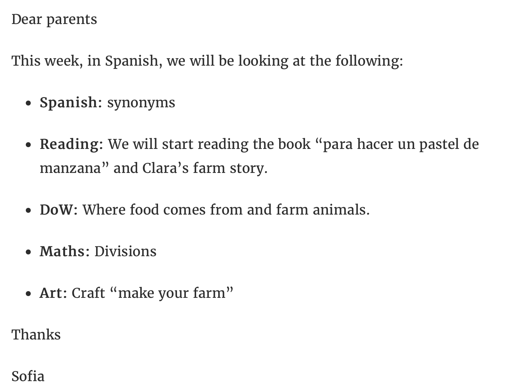
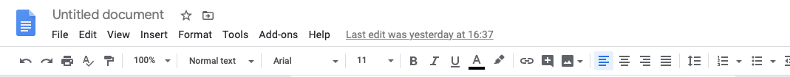
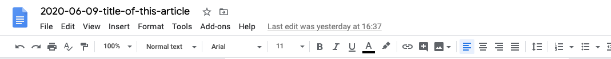
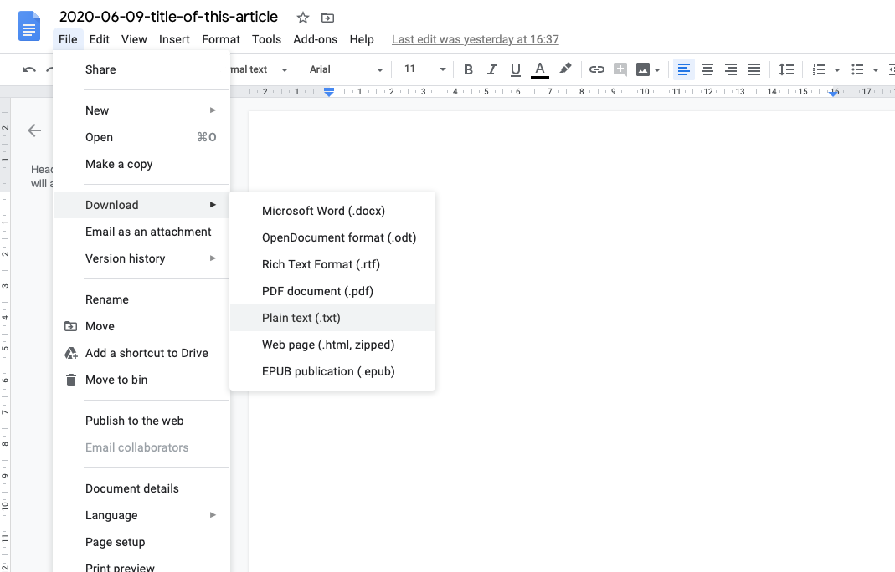

```{r setup, include=FALSE}
options(htmltools.dir.version = FALSE)
```

```{r xaringan-themer, include=FALSE, warning=FALSE}
library(xaringanthemer)
style_duo_accent(
  primary_color = "#1381B0",
  secondary_color = "#FF961C",
  inverse_header_color = "#FFFFFF"
)
```

# What is Markdown?

* Is a lightweight markup language that you can use to add formatting elements to plain text text documents

* Created by John Gruber in 2004

* Is now one of the world’s most popular markup languages

* It is used to make different types of documents including websites, notes, books, presentations, email, and documentation

* This presentation was created using a type of Markdown

---

.pull-left[

### This is an example of a Markdown of a page in the Class 3EE website

```MD
Dear parents
 
This week, in Spanish, we will be 
looking at the following:
 
* **Spanish:** synonyms
 
* **Reading:** We will start reading 
the book "para hacer un pastel de 
manzana" and Clara's farm story.
 
* **DoW:** Where food comes from and 
farm animals.
 
* **Maths:** Divisions
 
* **Art:** Craft "make your farm"
 
Thanks
 
Sofia
```
]

.pull-right[

### This is how it looks like on the actual Class 3EE website


]

---

# What do you notice with the Markdown document compared to the final output document?

* Except for very minor differences in some characters such as the asterisk or star used in Markdown, the Markdown document is exactly the same text as is the website output

* This is one of the really cool features of Markdown - its **human-readable format**

* This also gives you an idea of how easy it is to write your newspaper articles using Markdown

---

class: center, middle

## Are you ready to write your newspaper articles in Markdown?

---

class: center, middle

## In this tutorial, we will learn how to convert the newspaper articles that you created for English class into Markdown to prepare it for publication into the online newspaper created for this project

---

# What you will need

* A copy of your newspaper article or articles submitted to Mrs Trevitt

* A computer/device that you use for home school. This device should have access to your Google for Education account from school. Specifically, we will use **Google Docs**

---

# Step 1: Open a blank document in **Google Docs**

* When writing Markdown, you usually use what is called a **text editor** - an application on your computer that you use to write plain text

* **Google Docs** is not considered a plain text editor 

* However, because most of you have already been using **Google Docs** for home school, we will use it for creating your Markdown document

* Once you have written the Markdown version of your newspaper article in **Google Docs**, we will output this document from **Google Docs** into a text file. A text file is a file with an extension `.txt`

---

# Step 2: Writing the front matter

* A Markdown document usually has what is called a **front matter** at the start

* The **front matter** provides information regarding the document you are writing

* The **front matter** looks something like this:

```MD
---
title: Missing sausage dog found using bacon
author: Jane Doe
date: "2020-06-08"
---
```

* In this example **front matter**, the `title`, the `author`, and the `date` of the document are included.

* Depending on the document you are writing, other information are included in the **front matter**

---

# Step 2: Writing the front matter

* The **front matter** should always be at the start of the document.

* The **front matter** should always be written sandwiched between three dashes at the start and three dashes at the end:

```MD
---
FRONT MATTER HERE
---
```

* For the newspaper articles we are writing, we need the following information to be included in the front matter:

```MD
---
title: TITLE OF YOUR NEWSPAPER ARTICLE
author: YOUR NAME (OR A PSEUDONYM INSTEAD OF YOUR REAL NAME)
date: DATE WHEN YOU WROTE THE NEWSPAPER ARTICLE
---
```
---

class: center, middle

## You can now start writing the front matter for your newspaper article in the **Google Docs** you opened

---

# Step 3: Write your newspaper article

* This is probably the easiest step in the process

* Most of you have written your newspaper articles using **Google Docs** already, If you have, then you just need to do a simple copy and paste of your article

* Your Markdown document should look something like this by now:

```MD
---
title: Title of this article
author: My Name
date: "2020-06-09"
---

This is my article about a topic that was assigned to me by the 
teacher. It is a very interesting topic. I like writing about this 
topic. I hope many of my classmates will read my article.
```

---

# Step 4: Style your Markdown document

* You can now start adding some styling or formatting to your document

* This is done using standard Markdown styling or formatting rules. These rules are also called **syntax**.

* The next slides show commonly used Markdown syntax for styling or formatting documents

---

.pull-left[

### Markdown syntax

* ```*italics*``` or ```_italics_```

* ```**bold**``` or ```__bold__```

* ```> block quote```

* ```# Header 1```

* ```## Header 2```

* ```### Header 3```

* ```#### Header 4```

]


.pull-right[

### Resulting output

* *italics*

* **bold**

* > block quote

* # Header 1

* ## Header 2

* ### Header 3

* #### Header 4

]

---

.pull-left[

### Markdown syntax

* ```[link to 3EE website](https://www.europa-ee.org.uk)```

* adding an image: ``````

]


.pull-right[

### Resulting output

* [link to 3EE website](https://www.europa-ee.org.uk)

* adding an image: 

]

---

class: center, middle

# We now try to apply these rules to the sample newspaper article in Markdown document we saw earlier

---

# This syntax ...

```MD
---
title: Title of this article
author: My Name
date: "2020-06-09"
---

This is **my** article about a _topic_ that was assigned to me by the 
teacher. It is a very interesting topic. 

> I like writing about this topic. 

# I hope many of my classmates will read my article.
```

---

# Will look like this ...

### Title of this article

#### My Name

##### 2020-06-09

This is **my** article about a _topic_ that was assigned to me by the 
teacher. It is a very interesting topic. 

> I like writing about this topic. 

# I hope many of my classmates will read my article.

---

# Step 5: Naming your Markdown document

* Do this by tapping the upper right hand corner of the **Google Docs** that contains the placeholder name for the file (usually says *Untitled Document*)



* The filename of the Markdown document should always start with the ***date*** you wrote the document. It should be in this format: `YYYY-MM-DD`

* After the ***date***, you can now add any name you would like to give your document as its filename. The easiest is to use the title of your article like this: `2020-06-09-title-of-this-article`



---

# Step 6: Output as a text file

* As mentioned earlier, we are just using **Google Docs** as it is the most convenient and accessible tool for you to write Markdown

* But we need to save the Markdown document you created into a plain text file (something that ends in `.txt`)

---

# Step 6: Output as a text file

* **Google Docs** allows this kind of output. First, click on `File`, then select the `Download` option and then select the `Plain text (.txt)` option



* You will now have downloaded your Markdown file in plain text. You can find your file in the default download directory or folder of the device you are using

---

class: center, middle

## Congratulations! You have just produced your first ever Markdown document!

Make sure you keep the plain text file that you have created so that we can upload that to the online newspaper for publication.


