```{r setup, include=FALSE}
options(htmltools.dir.version = FALSE)
```

```{r xaringan-themer, include=FALSE, warning=FALSE}
library(xaringanthemer)
style_duo_accent(
  primary_color = "#1381B0",
  secondary_color = "#FF961C",
  inverse_header_color = "#FFFFFF"
)
```

class: center, middle

## Congratulations for completing the first part of this tutorial called "Learning Markdown"!

## You are now a member of Class 3EE's Online News Team!

---

# Recap

By now, you would have:

* Learned what Markdown is and what it's used for;

* Learned how to write Markdown, the front matter and the syntax;

* Written your own Markdown document using text from your newspaper articles; and,

* Saved your Markdown document waiting for publication online.

---

class: center, middle

## Now you are ready to publish your Markdown document online.

---

# Overview of publishing a Markdown document online

* Markdown documents on their own are just lines of text and code that include information on what the document would and should look like when published

* The code and syntax that you have placed in your Markdown document needs to be read and interpreted by a computer who understands Markdown language. This is called `parsing` of the Markdown document and the computer that knows how to read and interpret Markdown is called a `parser`

* After `parsing`, the computer will then convert your Markdown document into another format that is ready for online publication. This format is called `HTML` format

* Once converted, your document is then published online ready to be viewed by yourself and others on the internet

---

# Typical workflow of publishing a Markdown document online

```{r workflow1, echo = FALSE, eval = TRUE, fig.align = "center", fig.width = 14}
DiagrammeR::mermaid("
  graph LR
    X(START) --> A[<center>1.<br/>Write<br/>Markdown<br/>document</center>] 
    A        --> B[<center>2.<br/>Send Markdown<br/>document to<br/>a Markdown<br/>interpreter/parser</center>]
    B        --> C[<center>3.<br/>Markdown<br/>document is<br/>converted<br/>to HTML</center>]
    C        --> D[<center>4.<br/>HTML is<br/>published<br/>online</center>]
    D        --> Y(END)
  ", 
  height = 200)
```

---

# Our workflow for publishing Markdown to online newspaper

```{r workflow2, echo = FALSE, eval = TRUE, fig.align = "center", fig.width = 12}
DiagrammeR::mermaid("
  graph LR
    X(START) --> A[<center>1.<br/>Write<br/>Markdown<br/>document</center>] 
    A        --> B[<center>2.<br/>Send Markdown<br/>document to<br/>Hugo framework<br/>via GitHub</center>]
    B        --> C[<center>3.<br/>Send<br/>Markdown<br/>document in<br/>Hugo framework<br/>to Netlify<br/>through GitHub</center>]
    C        --> D[<center>4.<br/>Netlify converts<br/>Markdown and<br/>publishes HTML<br/>online</center>]
    D        --> Y(END)
  ", 
  height = 200)
```

---

# Our workflow for publishing Markdown to online newspaper

* You will notice that in our workflow, all we have to do are **Step 1** and **Step 2**.

* **Step 3** and **Step 4** are all done automatically for us.

* The online tools that help us with **Step 3** and **Step 4** are **GitHub**, **Hugo**, and **Netlify**

```{r workflow3, echo = FALSE, eval = TRUE, fig.show = "hold", out.width = "33.3%"}
knitr::include_graphics(path = "https://miro.medium.com/max/1400/1*pUZiZ11l8uqsNgRgnW6-Zg.png")

knitr::include_graphics(path = "https://d33wubrfki0l68.cloudfront.net/c38c7334cc3f23585738e40334284fddcaf03d5e/2e17c/images/hugo-logo-wide.svg")

knitr::include_graphics(path = "https://www.netlify.com/img/press/logos/full-logo-light.svg")
```

---

# Our workflow for publishing Markdown to online newspaper

* By now, you would have completed **Step 1** already after our first tutorial.

* We will now focus on completing **Step 2**.

* For this step, you will need:

    - A computer that can get on the internet;

    - The Markdown document/s that you have already converted into Markdown;

    - Permission from your parents and a little bit of help in doing all the online stuff;
    
---

class: center, middle

## Ready to start?

---

## Sign-in to GitHub

* Our most important tool for **Step 2** is **GitHub**

* **GitHub** is an online tool used mostly by people who write code for developing various kinds of software or for creating various online materials such as websites. **GitHub** allows its users to keep or save their code into repositories and **GitHub** provides tools for sending different kinds of code to its specific interpreter or parser to produce output.

* We have created generic **GitHub** accounts for each member of the Class 3EE News Team. Details of your accont have been provided to your parents. Please ask them for this and ask them to help you log-in.

* Sign in to **GitHub** at https://github.com/login using the login details provided

---

## Open the europa-ee/news repository

* Once you have signed in, you will see the following on your screen:

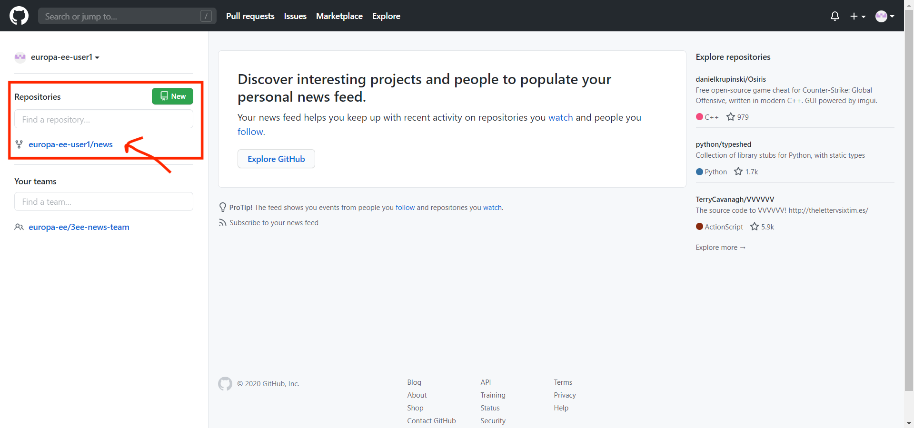

* On the left-hand side of the screen you will see under **Repositories** the **europa-ee/news** repository. Click this link.

---

## Open the content directory in the europa-ee/news repository

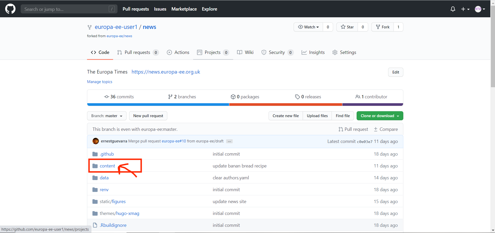

---

## Open the post directory in the content directory in the europa-ee/news repository

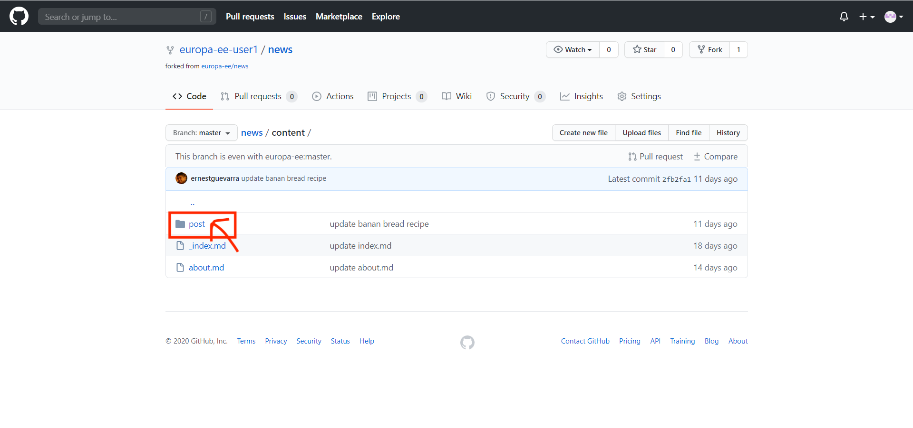

---

## Click on upload files to upload your Markdown document

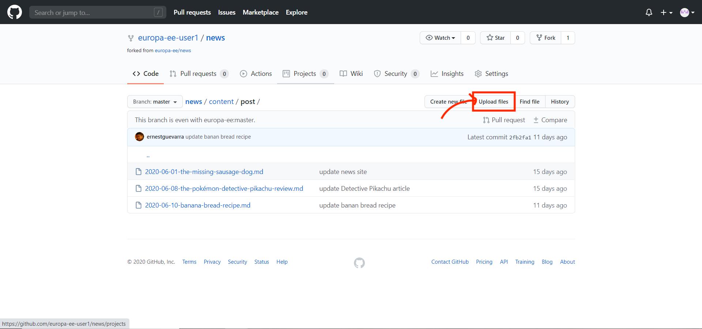

---

## Drag and drop your Markdown document or click on choose your files

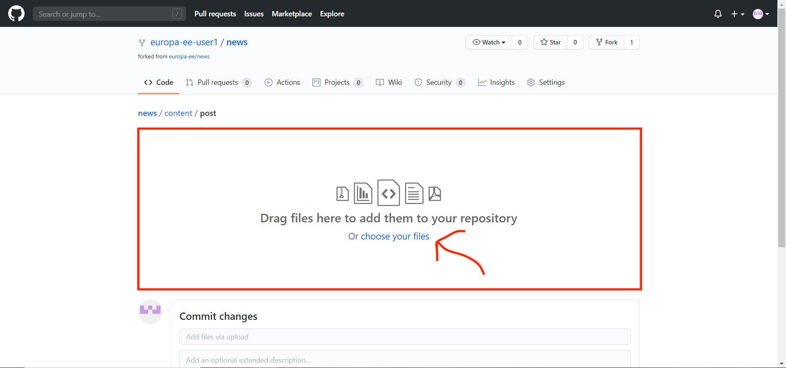

---

## Choose your Markdown document file to upload

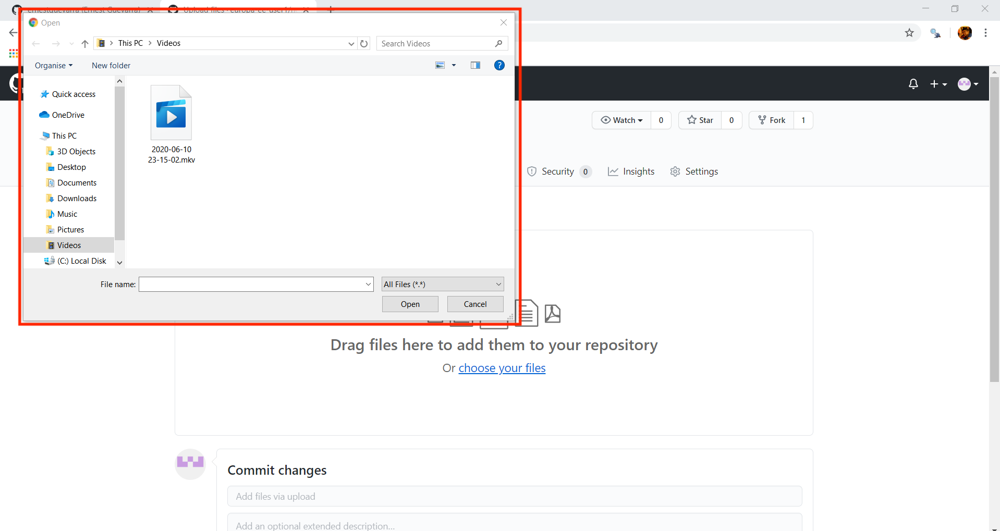

---

## Check that your file has been uploaded

* If you see your Markdown document file as below, then you know that you have successfully uploaded your document

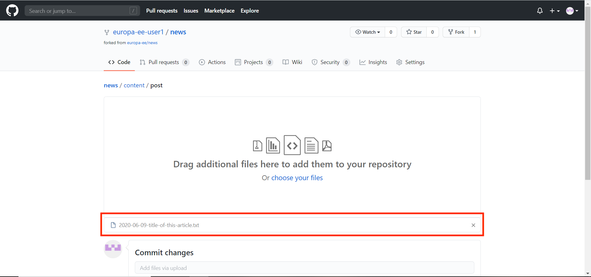

---

## Commit your changes

* Once you have uploaded your Markdown document, you will need to commit the changes you have made to the **europa-ee/news** repository

* Click on commit changes

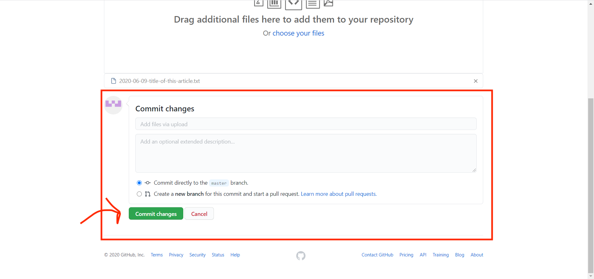

---

## Create a pull request

* So that your changes can be considered for publication online, you need to make a pull request.

* A pull request is the way for you to tell the **editor** of the online publication that you have uploaded your document.

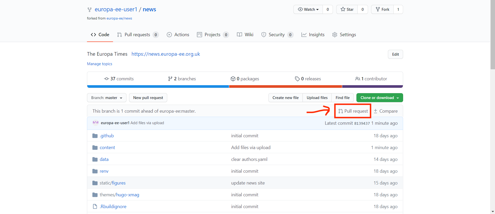

---

## Create a pull request

* Confirm the pull request

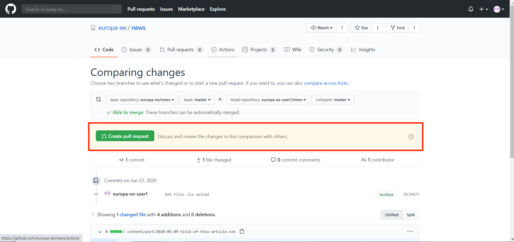

---

## Create a pull request

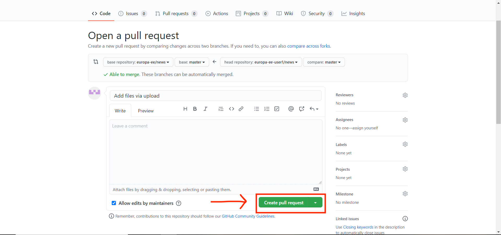

---

class: center, middle

## You have now successfully submitted your article for publication.

## The editor will review your submission, make edits to your text and Markdown syntax as needed and within at most an hour from submission, your article will be available online.

## You will be notified once the article is online

---

class: center, middle

## If you have more than one article that you would like to publish online, just repeat the process above for each article.